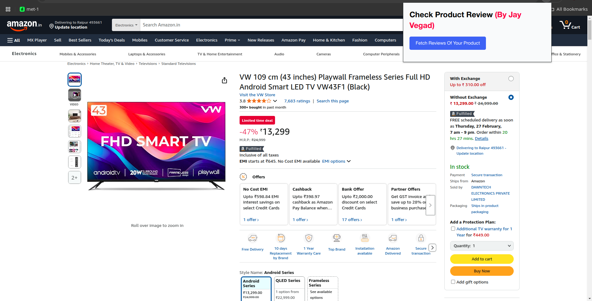
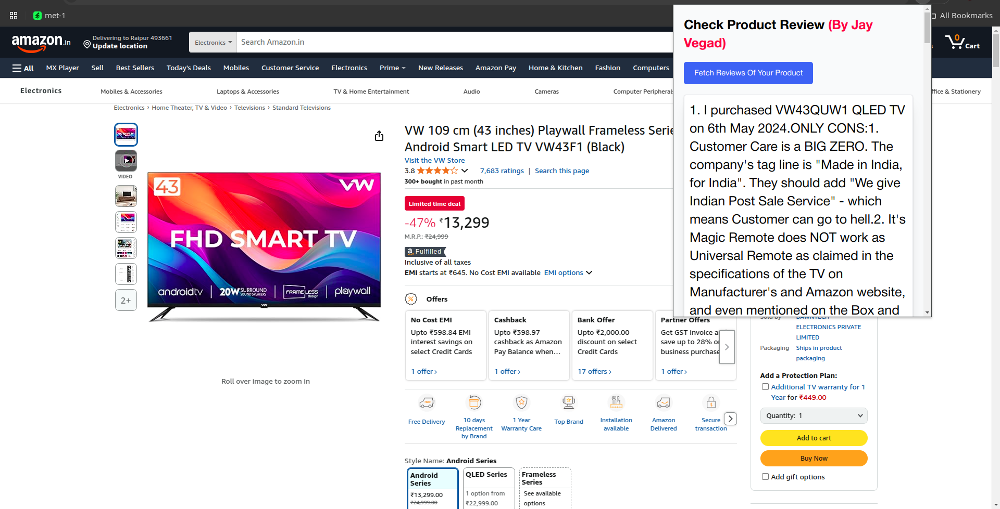
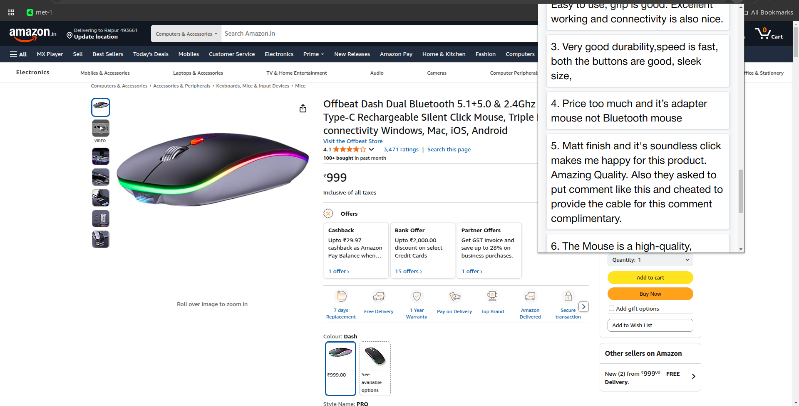

# Product Review Checker Chrome Extension 🔍

A powerful Chrome extension that helps online shoppers identify genuine product reviews by filtering out promotional and fake content.

## 🌟 Images

1. Basic Page for that extenstion.
   

2. Fetch all product reviews.
   
   

## 🌟 Features

- **Real-time Analysis**: Automatically scans product reviews as you browse
- **User-friendly Interface**: Seamlessly integrates with your shopping experience
- **Privacy Focused**: All processing happens locally - no data collection

## 📥 Installation Guide

### Method 1: Install from Chrome Web Store

1. Visit the [Chrome Web Store](https://chrome.google.com/webstore)
2. Search for "Product Review Checker"
3. Click "Add to Chrome"
4. Confirm the installation by clicking "Add extension"

### Method 2: Manual Installation (Developer Mode)

1. Download the extension:

   - Go to [GitHub Releases](https://github.com/Vegadjay/shopping-chrome-exe/releases)
   - Download the latest release `.zip` file
   - Extract the downloaded file to a folder on your computer

2. Install in Chrome:
   - Open Chrome and go to `chrome://extensions/`
   - Enable "Developer mode" in the top right corner
   - Click "Load unpacked"
   - Select the folder containing the extracted extension files
   - The extension icon should appear in your Chrome toolbar

## 🎯 How to Use

1. **After Installation**:

   - Click the extension icon in your Chrome toolbar
   - Pin the extension for easy access (optional)
   - Review and adjust settings if needed

2. **On Shopping Websites**:

   - Browse any supported shopping website
   - The extension automatically activates
   - View review analysis by clicking the extension icon
   - Green indicators show genuine reviews
   - Red indicators show potentially misleading reviews

3. **Settings & Customization**:
   - Right-click the extension icon
   - Select "Options"
   - Adjust:
     - Review filtering sensitivity
     - Display preferences
     - Notification settings

## 🔧 Supported Websites

- Amazon
- eBay
- Best Buy
- Walmart
- And many more online retailers

## ❗ Troubleshooting

1. **Extension Not Working?**

   - Ensure the extension is enabled
   - Check if you're on a supported website
   - Try refreshing the page
   - Clear browser cache if needed

2. **Icon Not Visible?**

   - Click the puzzle piece icon in Chrome toolbar
   - Find "Product Review Checker"
   - Click the pin icon to make it visible

3. **Other Issues?**
   - Right-click the extension icon
   - Select "Options"
   - Click "Report Issue"
   - Or create an issue on GitHub

## 👨‍💻 Author

**Jay Vegad**

- GitHub: [@Vegadjay](https://github.com/Vegadjay)
- LinkedIn: [Jay Vegad](https://www.linkedin.com/in/jayvegad)

## 🌟 Support

If you found this extension helpful:

- ⭐ Star the GitHub repo
- 📢 Share with friends and colleagues
- 💡 Suggest new features
- 🐛 Report any bugs you find

## 📞 Contact & Support

Need help? Reach out:

- Create an issue on GitHub
- Connect on LinkedIn
- Email: jayvegad10@gmail.com

---

Made with ❤️ by Jay Vegad
